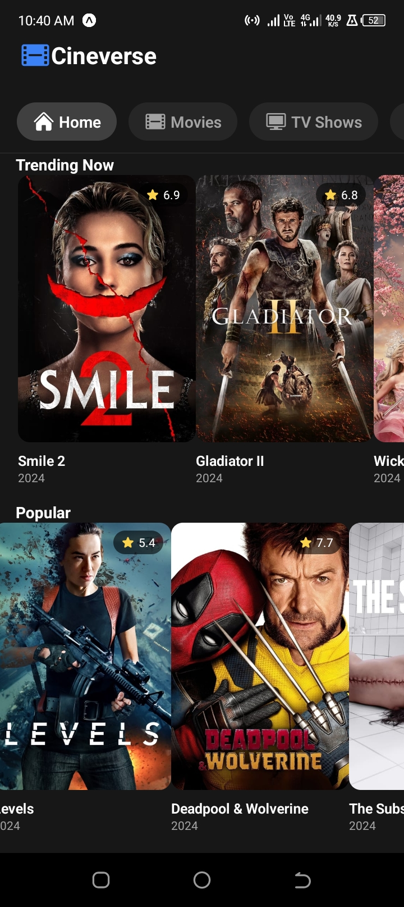

# MovieFlix - React Native Movie App

A modern, feature-rich movie and TV show discovery app built with React Native and Expo. Browse popular movies, TV shows, search for your favorites, and explore detailed information about each title.
---


### Android APK Download Link
[CineVerse](https://expo.dev/artifacts/eas/3jcnpN2yxMAadJsE7xmkSg.apk)

## 🎬 Features

- Browse popular movies and TV shows
- Search functionality for movies and TV shows
- Detailed view for movies and TV shows including:
  - Cast information
  - Similar titles
  - Production details
  - Ratings and reviews
- Responsive design for both iOS and Android
- Smooth animations and transitions
- Clean and modern UI

## 🚀 Tech Stack

- React Native
- Expo
- React Navigation
- NativeWind (TailwindCSS for React Native)
- TMDB API
- React Native Heroicons

## 📱 Screenshots

[Add your screenshots here]

## 🛠️ Installation

1. Clone the repository:
```bash
git clone https://github.com/onesmuskipchumba0/cineverse-mobile.git
cd cineverse-mobile
```

2. Install dependencies:
```bash
npm install
```

3. Create a `.env` file in the root directory and add your TMDB API key:
```
TMDB_API_KEY=your_api_key_here
```

4. Start the development server:
```bash
npx expo start
```

## 🏗️ Building the App

### Prerequisites
- Expo account
- EAS CLI installed globally: `npm install -g eas-cli`

### Build Commands

For Android (APK):
```bash
eas build -p android --profile production
```

For iOS:
```bash
eas build -p ios --profile production
```

## 📁 Project Structure

```
movieflix/
├── App.js
├── screens/
│   ├── HomeScreen.jsx
│   ├── MovieDetailScreen.jsx
│   ├── TVShowDetailScreen.jsx
│   └── SearchScreen.jsx
├── components/
│   ├── Loading.jsx
│   ├── TrendingMovies.jsx
│   └── Cast.jsx
├── navigation/
│   └── AppNavigator.jsx
└── assets/
    └── images/
```

## 🔑 API Configuration

This app uses The Movie Database (TMDB) API. You'll need to:
1. Create an account on TMDB
2. Get an API key
3. Add it to your .env file

## 🎨 Styling

The app uses NativeWind (TailwindCSS) for styling. Key style features include:
- Consistent spacing system
- Platform-specific adjustments
- Dark theme
- Responsive design

## 🤝 Contributing

1. Fork the repository
2. Create your feature branch (`git checkout -b feature/AmazingFeature`)
3. Commit your changes (`git commit -m 'Add some AmazingFeature'`)
4. Push to the branch (`git push origin feature/AmazingFeature`)
5. Open a Pull Request

## 📄 License

This project is licensed under the MIT License - see the LICENSE file for details

## 👏 Acknowledgments

- TMDB for providing the movie database API
- Expo team for the amazing development platform
- React Native community for the excellent ecosystem

## 📞 Contact


Project Link: [https://github.com/onesmuskipchumba0/cineverse-mobile](https://github.com/onesmuskipchumba0/cineverse-mobile)
